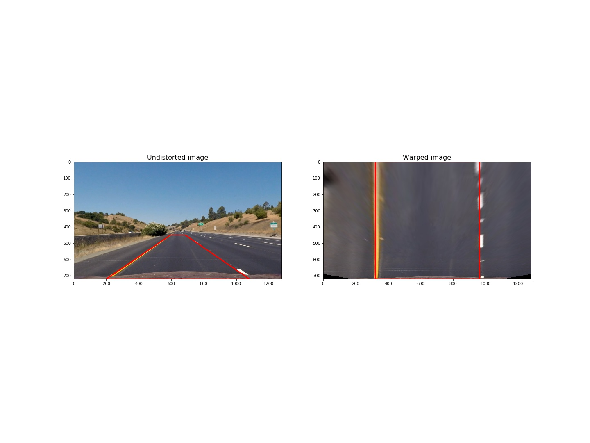

# Advance lane findig project
Author: Szabolcs Sergyan

### Overview

This writeup contains a brief overview of the advance lane findig project.

The code with short explanations can be found in file `mySolution.ipynb`. 
In the following descriptions I often refer to some parts of this file especially the containing codes.

The processed video which shows the detected lane with curvature and offset measures can be found in `result_project_video.mp4`.

In `python_source` folder my Python implementation can be found which can be run without a jupyter notebook environment.
In some points this implementation differs from the one in jupyter notebook file, because here the creation of output images was not implemented.

In the following each step of the pipeline is described briefly.

## 1. Camera calibration

Each camera has a distortion which should be corrected. 
In order to calibrate the camera 20 images of chessboards were captured with the camera (stored in the folder `camera-cal`). 
The `findChessboardCorners` method of OpenCV library is able to detect the inner corners of the chessboards.
From the 20 images 3 did not contain all inner corners, so finally only 17 images took part in the calibration process.
The `calibrateCamera` method of OpenCV library can determine the camera matrix and distortion coefficients which are the base of later correction in order to get rid of the effect of distortion one the images.

I implemented camera calibration in CameraCalibration class (see code cell 2 in my jupyter notebook file). 
First time the path of chessboard images is required as a parameter of the constructor, and the calculated camera matrix and distortion coefficients are stored in a pickle dump.
Later use the class can be instantiated without the path of the chessboard images, and camera parameters will be loaded from the picle dump.
If you want to undistort an image the `undistort` method of the class should be called by the image itself.

Here you can find an example of distortion correction for an image used in the lane line detection.

## 2. Color transform and gradients

In order to detect lane pixels I used three several transforms.

### 2.1. Detect yellow pixels in HSV color space

I found that in HSV color space yellow pixels can be found if H value in between 0 and 40, S value is between 80 and 255, and V value is between 200 and 255.

Here you will find an example for this image:

The mask after thresholding in HSV color space:

### 2.2. Detect pixels with high saturation

Yellow and white pixels on the road usually have high saturation value, so I used another thresholding to detect pixels with more than 170 as the saturation value is HLS color space.

Here you will find an example:

### 2.3. Horizontal sobel gradient

I used horizontal sobel gradient in the L channel of HLS color space, where L value is between 20 and 100.

Here you can see the example for this case:

In the project I applied the combination of the above mentined three mask.

Here you can see the result with the combination of these three methods:

The implementation of the color transform and gradients can be found in code cell 7 in my jupyter notebook.
I implemented it as a class and `colorAndGradientFiltering` method provides the combined result which is used as input in the following steps.

## 3. Perspective transform

Using perspective transform the original image of the road will be warped to a bird's eye view image.
In order to implement this four points must be defined in the source and the destination plane.

I implemented perspective transform in the PerspectiveTransform class (see code cell 12 in my jupyter notebook).
The source and destination pixels are defined in `_createSource` and `_createDestination` methods.

In this figure you can see the original trapezoid with the source pixels as corners and the transformed image where each source pixel is converted to pixels forming a rectangular.

## 4. Identify lane pixels and determine fitting polynomial

I implemented lane findig, polynomial fitting and curvature and position calculation in `LaneProcessor` class (see code cell 15 in my Jupyter notebook).

The input of lane finding is a binary image what is the result of color and gradient transform, and this image is in bird's eye view.
As the first step the histogram of the lower part of the image is determined along the horizontal direction (`histogramOfLowerPart` method).
In this histogram two peaks are determined, one on the left part and another one on the right part (`baseLeftX`and `baseRightX` methods).

Here you can see an example of the histogram with the peaks:

The peaks are the base x coordinates of the following windowing technique.

To detect a lane the image is divided equally into 9 windows. 
The windows' width is 150 pixels. 
The horizontal center point of the first window is one peak of the histogram.
In a window all nonzero pixels are considered and the mean value of their x coordinates is calculated.
This mean value is the center x coordinate of the consecutive window.
In each window all nonzero pixels are stored.
Using `polyfit` function of numpy library a second order polynomial is fitted to these nonzero points. (See code cells 18-20 in my Jupyter notebook).

## 5. Radius of curvature and position of the vehicle

In order to calculate the radius of lane curvature I used the `calculateCurvature` method of class `LaneProcessor`.
The position of the vehicle with respect to center is calculated in `getXOffset` method.

## 6. Example image where the result is plotted back onto he road

## Pipeline

The pipeline based on the above mentioned steps is implemented in function `processImage` (see code cell 22 in my Jupyter notebook).
The output video can be found in `result_project_video.mp4`.

## Discussion

I was able to solve this project and this works properly for the `project_video.mp4` as an input.
However for other two videos it needs more improvements.

I think it should developed with the followin approaches:
- Color transform should be applied more efficiently using other color spaces as well. Maybe CIELAB would be a good choice. Now I did not have more time to investigatre this opportunity.
- In the lane finding step for each video frame I used the same method where the result of previous frames are not taken into account. It should be a possible further development to use previously determined polynomials.
- In lane findig a sanity check should be used.